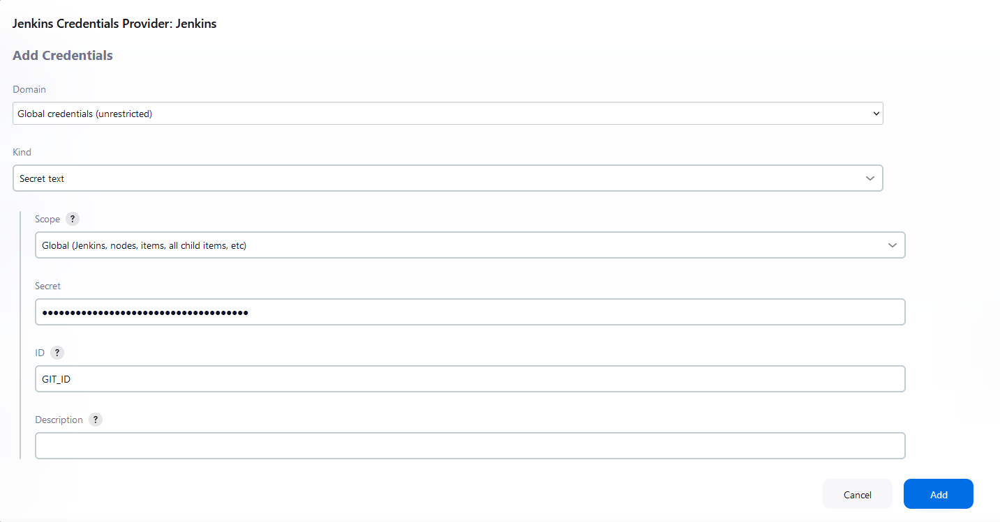
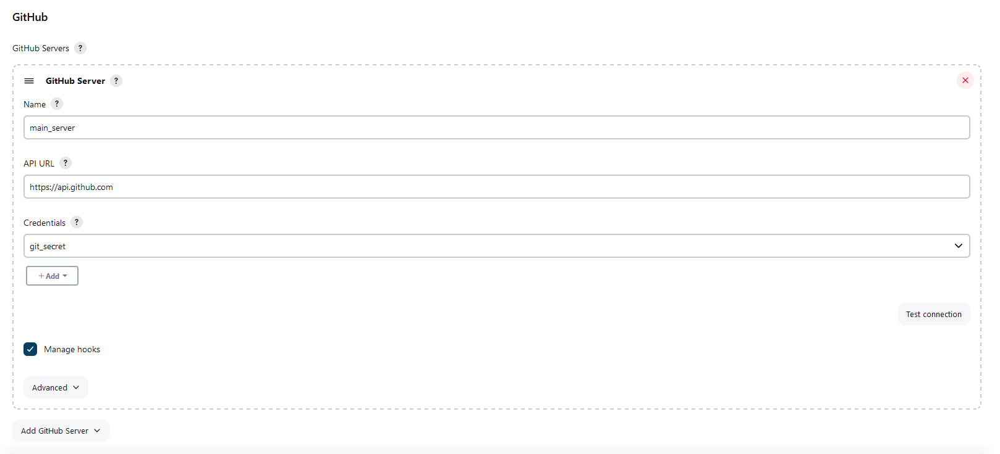
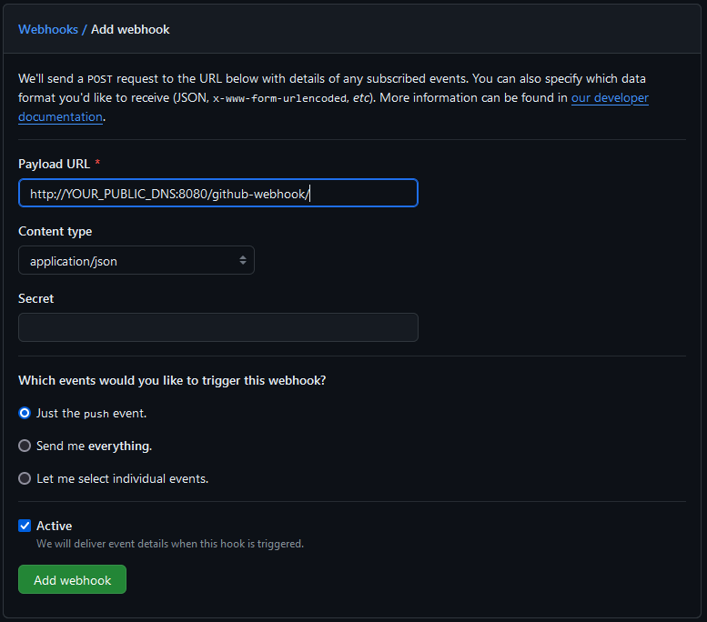

## Perquisites

- Docker: installed and configured
- DockerHub account
- AWS account: IAM user with approproate permissions; key pair, created and saved to /jenkins/terraform folder
- GitHub account and a GitHub access token with repo permissions

## Setting up your Jenkins

### Building the Jenkins image via JCasC

The provided JCaSC configuration allows access to Docker CLI and AWS CLI. Modify as needed.

- Navigate to /jenkins/jcasc
- Run the following Docker commands to build your image:

```
docker build -t yourDockerhubUsername/projectName:projectTag .
```

- Push the image to your Dockerhub

```
docker push yourDockerhubUsername/projectName:projectTag
```

## Terraform

- Navigate to /jenkins/terraform
- Paste in your SSH key directly into the directory, OR make sure to update the file source:

```
private_key = file(var.key_pair)
```

- Create your own terraform.tfvars file, and include:

```
aws_access_key = "YOUR_ACCESS_KEY"
aws_secret_access_key = "YOUR_SECRET_ACCESS_KEY"
key_pair_name = "YOUR_KEY"
key_pair = "YOUR_KEY.pem"
jenkins_admin_password = "YOUR_PASSWORD"
jenkins_image = "YOUR_IMAGE_HERE"
```

- Run the following commands:

```
terraform init
terraform plan
terraform apply
```

- Wait for terraform to finish. The console will output your AWS Public DNS.

## Jenkins

You can now access Jenkins at `http://YOUR_PUBLIC_DNS:8080` with the username "jenkins" and the password you have provided via .tfvars (or use the default "password")

## Setting up credentials

This step can be done separately or as a part of a pipeline.

- Navigate to **Dashboard -> Manage Jenkins -> Credentials**
- Click on **Domain -> Add Credentials**
- Set up GitHub/DockerHub (dependent on needs):

> Domain: Global credentials (unrestricted)<br>
> Kind: Username with password<br>
> Scope: Global<br>
> Username: YOUR_USERNAME<br>
> Password: YOUR_ACCESS_TOKEN<br>
> ID: YOUR_ID<br>

That's it! We got our credentials set up.

### Setting up GitHub server

- Inside Jenkins, navigate to **Manage Jenkins -> System**
- Scroll down to **GitHub Server**
- Add **GitHub Server**
- Give your server a name of your choosing
- Under **Credentials**, click +Add, choose Jenkins provider
- Configure Credentials as follows:

> Domain: Global credentials (unrestricted)<br>
> Kind: Secret text<br>
> Scope: Global<br>
> Secret: YOUR_GITHUB_ACCESS_TOKEN<br>
> ID: GIT_ID<br>



- Click Add, then choose GIT_ID from the Credentials dropdown
- Test Connection; you should see: `Credentials verified for user YOUR_USERNAME, rate limit: number`



Your GitHub server is now configured. Let's set up some pipelines.

## Setting up the pipeline

- Navigate to **Dashboard -> New Item -> Pipeline**
- Give your pipeline a name, then press OK
- In General, scroll down to Build Triggers and tick `GitHub hook trigger GITScm polling`
- Scroll down to Pipeline, and from the Definition dropdown pick `Pipeline script from SCM`
- Configure with the following:
  > SCM: Git<br>
  > Repository URL: YOUR_REPO_URL<br>
  > Credentials: YOUR_ID (**GitHub**)<br>
  > Branch Specifier: YOUR_BRANCH (or **main** by default)<br>
- Scroll down and Save<br>

Jenkins can now communicate with your repository and run pipelines from the Jenkinsfile.

## Webhooks

In order to set up a webhook, so that Jenkins automatically detects code changes in our app, we can do the following:

- Navigate to the correct repository on GitHub
- Settings -> Webhooks
- Add Webhook
  
- Configure as follows:
  > Payload URL: http://YOUR_PUBLIC_DNS:8080/github-webhook/<br>
  > Content type: application/json<br>
- Add webhook

Now your Jenkins will automatically build a new version of your application if it detects any repository changes to code.

## Considerations

- Security might be of issue. Accessing Jenkins via HTTP is not ideal, and to further improve our infrastructure, we could look into reverse proxy.
- JCasC can be as simple or as elaborate as the user/s desire. As we are using a public repository, we have not configured credentials/clouds/etc. within the JCaSC, which could speed up the setup.
- You can use HashiCorp Cloud to store your .tfstate as well as the SSH key for easy shared workspace.
